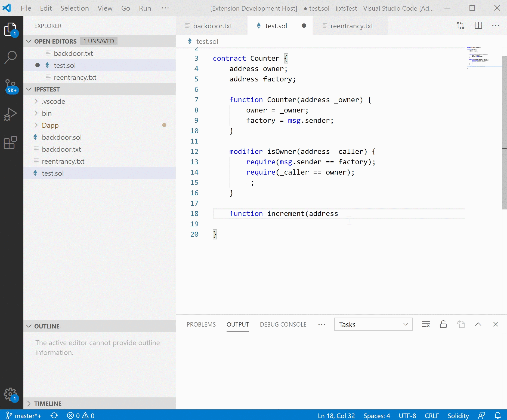

# Secsolidity README

Secsolidity is a vscode extension for writing solidity contracts in a safe way. 

## Features

For now, Secsolidity provides such features:

**a) Smart contract security check**

Secsoldity use a ensemble analysis tool to check whether there is a vulnerability in the current smart contract. At present, Secsolidity supports 56 kinds of common vulnerabilities such as 'Reentrancy', 'Overflow', 'TimeStamp Dependency' and 'Contract Backdoors'.

In order to use this function, the developer can use the following command:
```
SecSolidity: Analyze Contract
```
For now, the time limit for each contract is set as 60 seconds.


**b) Next token suggestion**

Secsolidity provides a suggestion for the next token. This is useful for a solidity beginner.

In order to use this function, the developer can click 'space' when he has finished typing the current token and use the following command:
```
Trigger Suggestion
```


**c) API completion**
Secsolidity supports api completion for common structs in solidity language such as `msg` and `block`.

**d) Highlight**
Secsolidity implements a highlight feature for solidity language.


## Usage

The current version of Secsolidity is still under development. You can only use it by cloning the repository and run the extension in debugging mode. You can use this tool by the followint commands:
```
git clone https://github.com/fCorleone/SecSolidity.git
cd SecSolidity
npm install
code .
```
After opening the repository in VScode, press F5 to debug and open your workspace which contains the solidity files.

**Enjoy!**
