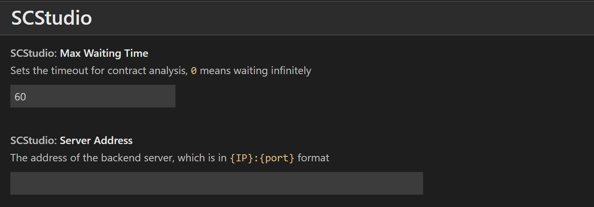
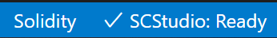
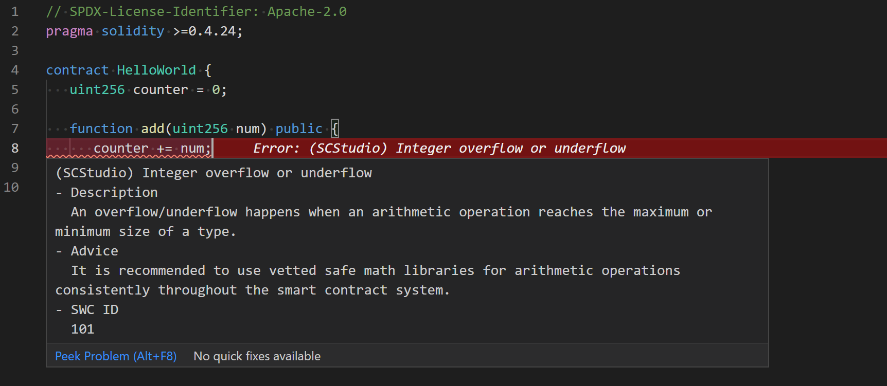
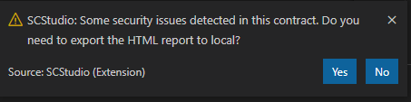

# SCStudio

SCStudio 是一款用于检测 Solidity 合约安全性的[VS Code](https://code.visualstudio.com/)插件，由清华大学软件系统安全保障小组开发并贡献。

_当前，本项目由 fCorleone([@fCorleone](https://github.com/fCorleone)，清华大学)、renardbebe([@renardbebe](https://github.com/renardbebe)，清华大学)及 vita-dounai([@vita-dounai](https://github.com/vita-dounai)，微众银行)负责维护开发. 如果你在使用过程中遇到了任何问题，请移步至[issue 区](https://github.com/FISCO-BCOS/SCStudio/issues)提交 issue。_

## 一、快速开始

### 1.1 安装

打开 VS Code 后，点击左侧侧边栏中“扩展”一项，并在弹出扩展列表顶部的搜索框中键入“SCStudio“并搜索，在搜索结果中选择第一项扩展进行安装，并按照 VS Code 的要求重新载入窗口。

### 1.2 配置

SCStudio 的配置项位于`文件 -> 首选项 -> 设置 -> 扩展 -> SCStudio`路径下，当前 SCStudio 提供以下配置项：



-   `Max Waiting Time`：在 SCStudio 的使用过程中，SCStudio 会将合约代码提交至后端检测服务进行安全检测，由于此过程中涉及网络交互、符号执行等过程，可能会耗时较久（根据合约的复杂程度，分析过程可能会持续数秒至数分钟不等），你可以通过该配置项指定 SCStudio 的最大超时时间（以秒为单位），以避免 SCStudio 陷入无尽等待，该配置项默认设置为 60 秒。特别地，你可以将`Max Waiting Time`配置为 0，此时分析过程启动后，SCStudio 将会持续等待直至后端检测服务返回分析结果或网络出现异常；

-   `Server Address`：此配置项用于配置运行后端检测服务的服务器地址，包括 IP 地址及端口。当该配置项为空时，SCStudio 会将合约代码提交至用于试用的示例服务器进行分析检测，此时需要有可用的外部网络连接。你也可以按照[部署本地检测服务](#二部署本地检测服务)一节中的说明，在本地搭建后端检测服务，并将`Server Address`配置为本地检测服务的地址。`Server Address`配置项的格式为`<IP地址>:<端口>`，例如“127.0.0.1:7898”。

当配置更新后，需要进行保存以使配置项生效。

### 1.3 使用

当在 VS Code 中新建或打开一个后缀名为“.sol”的文件后，SCStudio 插件将自动载入并初始化。当初始化完成后，VS Code 右下角的状态栏中将显示“SCStudio: Ready”字样：



当 SCStudio 进入就绪（Ready）状态后，你可以通过以下四种方式触发 SCStudio 对当前编辑窗口中的合约代码进行安全性检测：

-   命令：打开 VS Code 命令栏（Windows 及 Linux 下可通过 `Ctrl + Shift + P`快捷键、OS X 可通过 `Command + Shift + P`快捷键），并执行“SCStudio: Analyze Contract”或“SCStudio: Analyze Contract Without Compiling”命令即可开始对合约代码进行分析。两种命令的区别仅在于后者不会对合约代码进行本地编译。一般而言选择“SCStudio: Analyze Contract”可获得更多错误提示。

-   右键菜单：在编辑窗口中点击鼠标右键，在弹出的菜单中点击“Analyze Contract”或“Analyze Contract Without Compiling”，其效果分别等同于执行“SCStudio: Analyze Contract”及“SCStudio: Analyze Contract Without Compiling”命令；

-   状态栏：可以直接点击 VS Code 右下角状态栏中“SCStudio: Ready”字样，点击后 SCStudio 将开始执行“SCStudio: Analyze Contract”命令；

-   快捷键：`Ctrl + F10`（macOS 下为`Command + F10`）可执行“SCStudio: Analyze Contract”命令；`Ctrl + Shift + F1`（macOS 下为`Command + Shift + F10`）可执行“SCStudio: Analyze Contract Without Compiling”命令。

需要注意的是，当 SCStudio 开始对合约进行分析后，SCStudio 由就绪状态转变为分析（Analyzing）状态，此时 VS Code 右下角状态栏中将显示“SCStudio: Analyzing”字样及相关动画，此时状态栏暂时无法点击、右键菜单中 SCStudio 相关菜单项暂时不可用，同时相关命令及快捷键也将暂时失效，直至分析过程结束、SCStudio 重新进入就绪状态。

当 SCStudio 检测合约代码中存在安全性问题后，会通过彩带形式进行显式提示。当鼠标悬停于彩带上时，会显示错误详情、修复建议等信息，如下图所示；



除彩带提示外，当合约代码中存在安全性问题时，SCStudio 会以通知的形式询问是否是否需要将检测报告保存至本地：



当选择“Yes”后，SCStudio 将打开文件浏览器，你需要在文件浏览器中选择报告的存放位置。选择完毕后，SCStudio 将在指定位置生成一份 HTML 格式的检测报告，报告文件的名称形如“VulnerabilitiesReport\_{date}.html”，其中`{data}`为生成报告时的日期及时间。检测报告提供了界面更加友好的错误展示，你可以使用浏览器打开检测报告并进行浏览：


### 二、部署本地检测服务

若`Server Address`配置项设置为空，则在合约代码分析过程中，SCStudio 会将合约代码提交至仅用于试用的示例服务器，以获取检测服务。由于示例服务器的资源有限，此过程可能会不稳定或耗时较长，同时，由于示例服务器运行于公网环境，可能会造成合约内容的外泄。因此对于对用户体验及隐私性有较高需求的用户，推荐在本地部署检测服务。

检测服务依赖于 Docker，因此部署服务前需要在本地预先[安装](https://www.docker.com/get-started)Docker，当前检测服务能够运行于 macOS 、 Linux 或安装有 WSL2 的 Windows 环境中，部署过程如下：

```bash
# 安装Mythril
docker pull mythril/myth
# 安装Oyente
docker pull qspprotocol/oyente-0.4.25
# 根据合约中要求的Solidity编译器版本安装Solidity编译器
# 此处以安装0.4.26版本的Solidity编译器版本为例
docker pull ethereum/solc:0.4.26
# 安装检测服务
docker pull lichenxiwebank/scstudio_backend:1.0.0
# 运行检测服务
docker run -v /var/run/docker.sock:/var/run/docker.sock -v /tmp:/tmp -p 8001:7898 -it --rm lichenxiwebank/scstudio_backend:1.0.0
cd backend/ && ./start_server.sh
```

容器内的检测服务固定监听 7898 端口，可以在执行`docker run`命令时修改`-p`选项参数指定宿主与容器间的端口映射。在上述示例中，宿主的 8001 端口将会被映射至容器的 7898 端口，因此需要将`Server Address`配置项修改为“127.0.0.1:8001”，SCStudio 才能够正常访问本地的检测服务。
