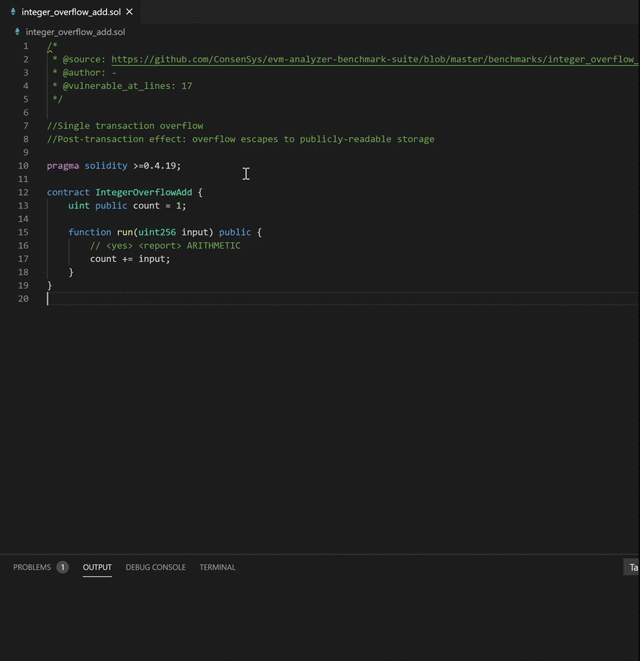
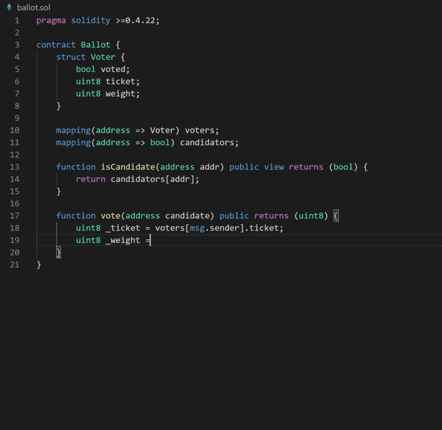

# SCStudio 

SCStudio is an extension of [VS Code](https://code.visualstudio.com/) for writing solidity contracts in a safe way.

*This repository is currently maintained by Chenxi Li([@vita-dounai](https://github.com/vita-dounai)), Fucheng Ma([@fCorleone](https://github.com/fCorleone)) and Meng Ren([@renardbebe](https://github.com/renardbebe)). If you encounter any bugs or usage issues, please feel free to create an issue on [our issue tracker](https://github.com/FISCO-BCOS/SCStudio/issues).*

## Quick Start

### Smart contract security check

SCStudio use an ensemble analysis tool to check whether your smart contract is vulnerable. At present, SCStudio supports **56** kinds of common vulnerabilities such as 'Reentrancy', 'Overflow', 'TimeStamp Dependency' and 'Contract Backdoors'.

You can type the following command in VS Code to verify your smart contract:

```
SCStudio: Analyze Contract
```

By default, the time limit for each contract is set as 60 seconds.
You can set the time limit by using the following command:

```txt
SCStudio: Set Maximum Wait-time for Security Analysis
```

Now, the time limit for each contract is set as 10 seconds.



### Next token suggestion

SCStudio provides a suggestion for the next token. This is useful for a solidity beginner.

In order to use this function, the developer should first use the following command to enable it:

```
SCStudio: Enable Recommand
```

Then the developer can click 'space' when he has finished typing the current token.



If you want to disable this feature, please use

```
SCStudio: Disable Recommand
```

**c) API completion**
SCStudio supports api completion for common structs in solidity language such as `msg` and `block`.

**d) Highlight**
SCStudio implements a highlight feature for solidity language.

## Use SCStudio in VS Code

The current version of SCStudio supports two ways to analyze your smart contracts. If you don't want to upload your contract to any server, we provide a docker image to let you check your code locally. Please first install `docker` for your system, you can follow the instructions [here](https://docs.docker.com/get-docker/). After installing `docker`, you need to pull the image of our contract analyzing tool by :

```bash
docker pull renardbebe/entools
```

Meanwhile, if you want to use a web service to analyze the contract, you need first use the following command to enable the web service.

```
SCStudio: Enable the web service
```

Then, please set the url of your web service by the following command:
```
SCStudio: Set the url of the web service
```


## Usage

The current version of SCStudio is still under development. You can only use it by cloning the repository and run the extension in debugging mode. You can use this tool by the followint commands:
```shell
git clone https://github.com/FISCO-BCOS/SCStudio
cd SCStudio
# install dependency-package
npm install
# install dependency-extension
code --install-extension philhindle.errorlens
code --install-extension JuanBlanco.solidity
# launch vscode
code .
```
After opening the repository in VScode, press F5 to debug and open your workspace which contains the solidity files.

**Enjoy!**
