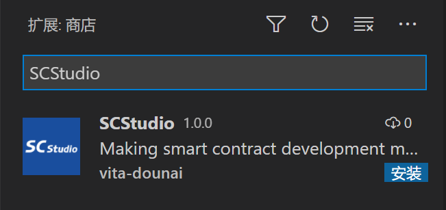
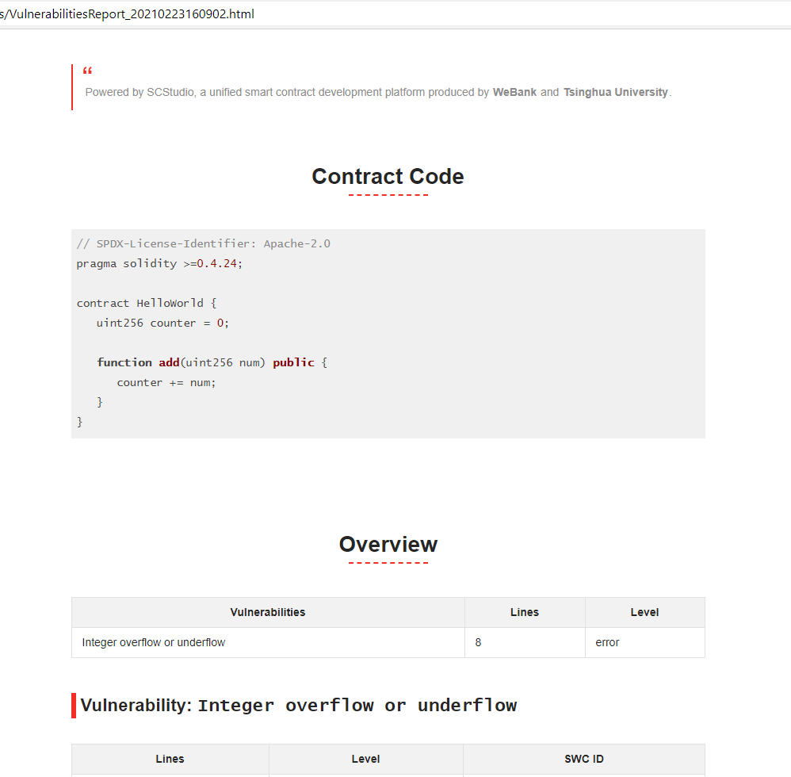

# SCStudio: Making smart contract development more secure

SCStudio 是一款针对 Solidity 合约的安全分析工具。在[Visual Studio Code](https://code.visualstudio.com/)（VS Code）开发环境下，开发者可通过 SCStudio 提供的 VS Code 扩展，在合约的开发过程中使用 SCStudio 进行实时安全性检查。SCStudio 由[清华大学软件系统安全保障小组](http://www.wingtecher.com/)开发并贡献。

_当前，本项目由[fCorleone](https://github.com/fCorleone)（清华大学）及[renardbebe](https://github.com/renardbebe)（清华大学）负责维护。 如果你在使用过程中遇到了任何问题，请移步至[issue 区](https://github.com/FISCO-BCOS/SCStudio/issues)提交 issue。_

## 一、快速开始

### 1.1 安装 Visual Studio Code 插件

启动 Visual Studio Code 后，点击左侧侧边栏中“扩展”一项，在弹出扩展列表顶部的搜索框中键入“SCStudio”并搜索，在搜索结果中选择 SCStudio 进行安装。安装完毕后，遵循 Visual Studio Code 的提示重新载入窗口。



### 1.2 配置

在 Visual Studio Code 的顶部菜单栏中依次点击`文件`、`首选项`、`设置`、`扩展`、`SCStudio`，可对 SCStudio 进行配置。当前 SCStudio 提供下列配置项：


-   `Max Waiting Time`：在 SCStudio 对合约代码进行安全性检测时，会涉及网络交互、符号执行等较为耗时的过程。根据合约的复杂程度，检测过程可能会持续数秒至数分钟不等。为避免 SCStudio 陷入无尽等待，可以通过该配置项指定 SCStudio 的最大超时时间（以秒为单位）。该配置项默认设置为 60 秒。特别地，`Max Waiting Time`可配置为 0，此时启动检测过程后，SCStudio 将会持续等待，直至后端检测服务返回分析结果或网络出现异常；

-   `Server Address`：此配置项用于配置后端检测服务的服务器地址，包括 IP 地址及其端口。当该配置项为空时，SCStudio 会将合约代码提交至用于试用服务器进行分析检测，此时需要有可用的外部网络连接。也可以按照[部署本地检测服务](#二部署本地检测服务)一节中的说明，在本地搭建后端检测服务，并将`Server Address`配置为本地检测服务的地址。`Server Address`配置项的格式为`<IP地址>:<端口>`，例如“127.0.0.1:7898”。

当配置更新后，需要对配置文件进行保存以使配置项生效。

### 1.3 使用

当在 Visual Studio Code 中新建或打开一个后缀名为“.sol”的文件后，SCStudio 插件将自动载入并初始化。当初始化完成后，VS Code 右下角的状态栏中将显示“SCStudio: Ready”字样：


此时 SCStudio 进入就绪（Ready）状态，你可以通过以下四种方式触发 SCStudio 对当前编辑窗口中的合约代码进行安全性检测：

-   命令：打开 VS Code 命令栏（Windows 及 Linux 下可通过 `Ctrl + Shift + P`快捷键、macOS 可通过 `Command + Shift + P`快捷键），并执行“SCStudio: Analyze Contract”或“SCStudio: Analyze Contract Without Compiling”命令即可开始对合约代码进行分析。两种命令的区别仅在于后者不会对合约代码进行自动编译。一般而言选择“SCStudio: Analyze Contract”可获得更多错误提示；

-   右键菜单：在编辑窗口中点击鼠标右键，在弹出的菜单中点击“Analyze Contract”或“Analyze Contract Without Compiling”，其效果分别等同于执行“SCStudio: Analyze Contract”或“SCStudio: Analyze Contract Without Compiling”命令；

-   状态栏：可以直接点击 VS Code 右下角状态栏中“SCStudio: Ready”字样，点击后 SCStudio 将开始执行“SCStudio: Analyze Contract”命令；

-   快捷键：`Ctrl` + `F10`（macOS 下为`Command` + `F10`）可执行“SCStudio: Analyze Contract”命令；`Ctrl` + `Shift` + `F1`（macOS 下为`Command` + `Shift` + `F10`）可执行“SCStudio: Analyze Contract Without Compiling”命令。

需要注意的是，当 SCStudio 开始对合约进行分析后，SCStudio 将由就绪状态转变为分析（Analyzing）状态，此时 VS Code 右下角状态栏中将显示“SCStudio: Analyzing”字样及对应动画，此时状态栏暂时无法点击、右键菜单中 SCStudio 相关菜单项暂时不可用，同时相关命令及快捷键也将暂时失效，直至分析过程结束、SCStudio 重新进入就绪状态。

当 SCStudio 检测到合约代码中存在安全性问题后，会通过彩带形式进行显式提示。当鼠标悬停于彩带上时，会显示错误详情、修复建议等信息，如下图所示；


除彩带提示外，当合约代码中存在安全性问题时，SCStudio 会以通知的形式询问是否需要将检测报告保存至本地：


当选择“Yes”后，SCStudio 将打开文件浏览器，可在文件浏览器中选择报告的存放目录。选择完毕后，SCStudio 将在指定目录生成一份 HTML 格式的检测报告，报告文件的名称形如“VulnerabilitiesReport\_{date}.html”，其中`{data}`为生成报告时的日期及时间。检测报告提供了界面更加友好的错误展示，你可以使用浏览器打开检测报告并进行浏览：



### 二、部署本地检测服务

若`Server Address`配置项设置为空，则在合约代码检测的过程中，SCStudio 会将合约代码提交至试用服务器以进行检测。由于试用服务器的计算资源有限，此过程可能会较不稳定或耗时较长。同时，由于试用服务器运行于公网环境，因此可能会造成合约内容的外泄。若对用户体验或隐私性有较高要求，推荐在本地部署检测服务。

检测服务依赖于 Docker，因此部署服务前需要在本地预先[安装](https://www.docker.com/get-started)Docker，当前检测服务能够运行于 macOS 、 Linux 或安装有 WSL2 的 Windows 环境中，部署过程如下：

```bash
# 安装Mythril
docker pull mythril/myth
# 安装Oyente
docker pull qspprotocol/oyente-0.4.25
# 根据合约中要求的Solidity编译器版本安装Solidity编译器
# 此处以安装0.4.26版本的Solidity编译器为例
docker pull ethereum/solc:0.4.26
# 安装检测服务
docker pull fiscoorg/scstudio_backend:latest
# 运行检测服务
docker run -v /var/run/docker.sock:/var/run/docker.sock -v /tmp:/tmp -p 8001:7898 -it --rm fiscoorg/scstudio_backend:latest
cd backend/ && ./start_server.sh
```

容器内的检测服务固定监听**容器内的**7898 端口，可以在执行`docker run`命令时修改`-p`选项参数指定宿主与容器间的端口映射。在上述示例中，宿主的 8001 端口将会被映射至容器的 7898 端口，因此需要将`Server Address`配置项修改为“127.0.0.1:8001”，SCStudio 便能够正常访问本地的检测服务。
